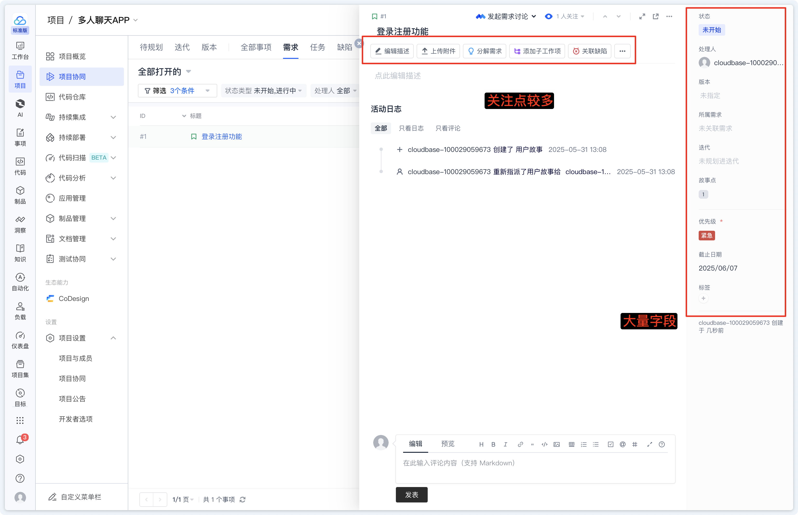
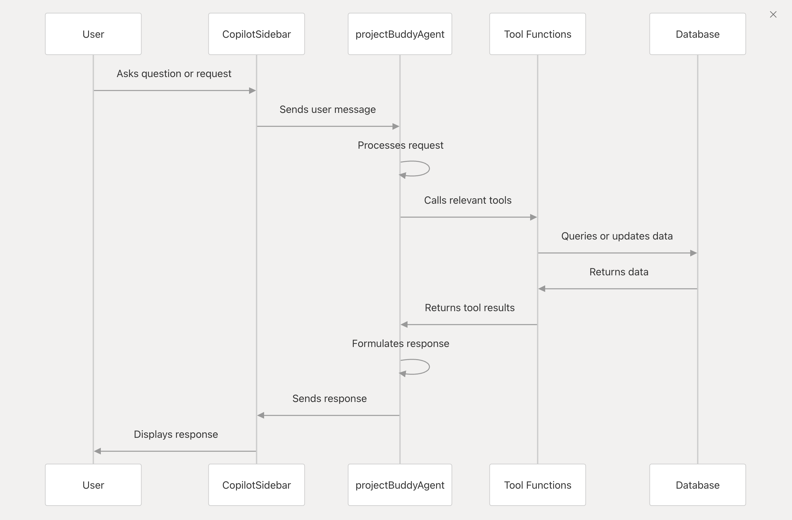
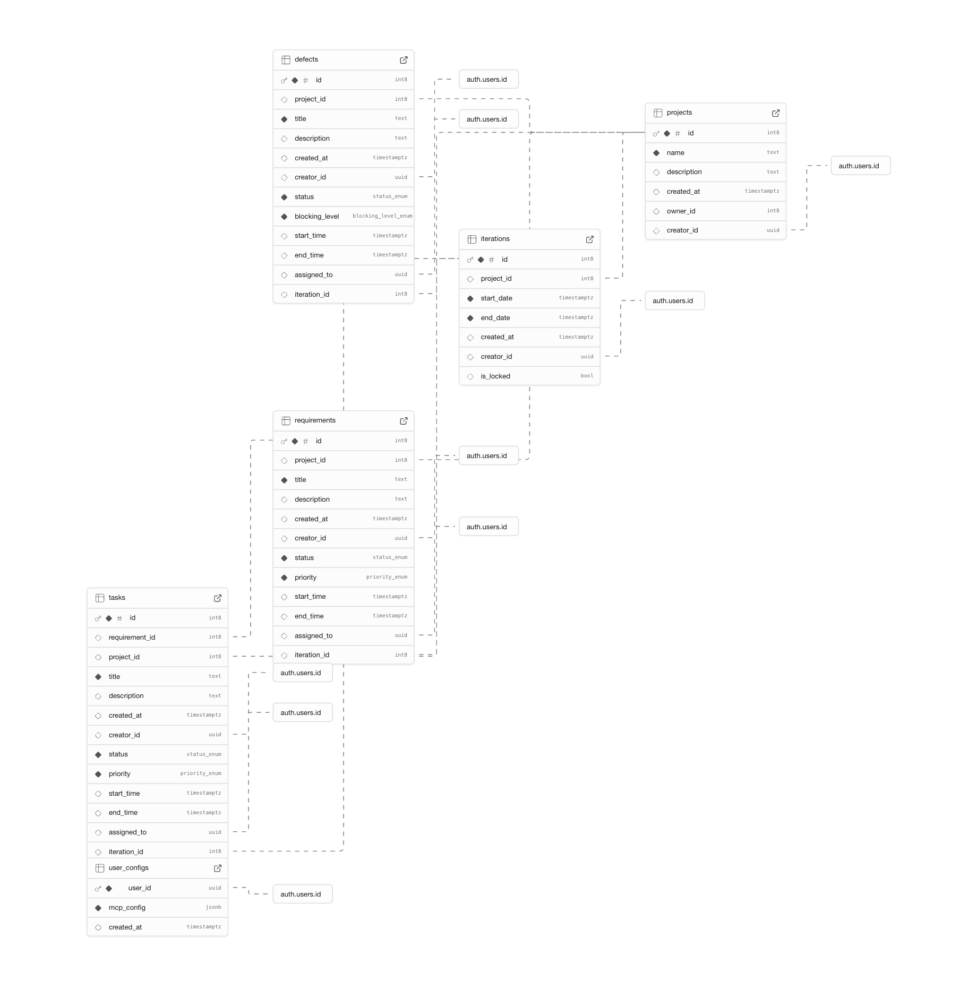

# 基于 Agent + MCP 的需求管理平台设计与实现

AI 驱动的智能化需求管理解决方案

<div class="uppercase text-sm tracking-widest">
冯少康 | 通信工程 2103 | 悉尼智能科技学院
</div>

<div class="abs-bl mx-14 my-12 flex">
  
  <div class="ml-3 flex flex-col text-left">
    <div>东北大学</div>
    <div class="text-sm opacity-50">2025.06.03</div>
  </div>
</div>

---

<h2 class="text-center">
📋 目录
</h2>

<div class="flex flex-col space-y-3 mt-8 max-w-md mx-auto">
  <div class="flex items-center space-x-3 p-3 rounded-lg bg-gradient-to-r from-blue-50 to-blue-100 dark:from-blue-900/20 dark:to-blue-800/20">
    <div class="w-2 h-2 bg-blue-500 rounded-full"></div>
    <span class="text-base font-medium">🎯 背景</span>
  </div>

  <div class="flex items-center space-x-3 p-3 rounded-lg bg-gradient-to-r from-green-50 to-green-100 dark:from-green-900/20 dark:to-green-800/20">
    <div class="w-2 h-2 bg-green-500 rounded-full"></div>
    <span class="text-base font-medium">🔧 关键技术概述</span>
  </div>

  <div class="flex items-center space-x-3 p-3 rounded-lg bg-gradient-to-r from-purple-50 to-purple-100 dark:from-purple-900/20 dark:to-purple-800/20">
    <div class="w-2 h-2 bg-purple-500 rounded-full"></div>
    <span class="text-base font-medium">🏗️ 系统架构设计</span>
  </div>

  <div class="flex items-center space-x-3 p-3 rounded-lg bg-gradient-to-r from-orange-50 to-orange-100 dark:from-orange-900/20 dark:to-orange-800/20">
    <div class="w-2 h-2 bg-orange-500 rounded-full"></div>
    <span class="text-base font-medium">✨ 模块实现亮点</span>
  </div>

  <div class="flex items-center space-x-3 p-3 rounded-lg bg-gradient-to-r from-red-50 to-red-100 dark:from-red-900/20 dark:to-red-800/20">
    <div class="w-2 h-2 bg-red-500 rounded-full"></div>
    <span class="text-base font-medium">🧪 系统测试</span>
  </div>

  <div class="flex items-center space-x-3 p-3 rounded-lg bg-gradient-to-r from-indigo-50 to-indigo-100 dark:from-indigo-900/20 dark:to-indigo-800/20">
    <div class="w-2 h-2 bg-indigo-500 rounded-full"></div>
    <span class="text-base font-medium">🚀 总结与展望</span>
  </div>
</div>

---
layout: center
---

<div class="from-red-50 via-orange-50 to-yellow-50">
  <!-- 左侧内容区 -->
  <div class="space-y-8">
    <!-- 标题区域 -->
    <div class="text-center mb-8">
      <h2 class="font-black bg-gradient-to-r from-red-600 to-orange-600 bg-clip-text text-transparent mb-2">
        传统需求管理痛点：效率低下
      </h2>
      <div class="text-gray-600 font-medium">
        手工操作繁琐，信息孤岛严重
      </div>
    </div>
    <!-- 痛点列表 -->
    <div class="grid grid-cols-1 gap-4">
      <div class="flex items-center space-x-4 p-4 bg-white/70 rounded-xl shadow-sm border border-red-100">
        <div class="flex-shrink-0 w-8 h-8 bg-red-500 rounded-full flex items-center justify-center">
          <span class="text-white text-sm font-bold">1</span>
        </div>
        <div>
          <span class="font-bold text-red-700 dark:text-red-400">需求收集繁琐：</span>
          <span class="text-gray-700 dark:text-gray-300">多渠道沟通、反馈周期长，易遗漏关键信息</span>
        </div>
      </div>
      <div class="flex items-center space-x-4 p-4 bg-white/70 dark:bg-gray-800/70 rounded-xl shadow-sm border border-orange-100 dark:border-orange-900/30">
        <div class="flex-shrink-0 w-8 h-8 bg-orange-500 rounded-full flex items-center justify-center">
          <span class="text-white text-sm font-bold">2</span>
        </div>
        <div>
          <span class="font-bold text-orange-700 dark:text-orange-400">任务拆分依赖经验：</span>
          <span class="text-gray-700 dark:text-gray-300">缺乏统一标准，拆分颗粒度参差不齐</span>
        </div>
      </div>
      <div class="flex items-center space-x-4 p-4 bg-white/70 dark:bg-gray-800/70 rounded-xl shadow-sm border border-yellow-100 dark:border-yellow-900/30">
        <div class="flex-shrink-0 w-8 h-8 bg-yellow-500 rounded-full flex items-center justify-center">
          <span class="text-white text-sm font-bold">3</span>
        </div>
        <div>
          <span class="font-bold text-yellow-700 dark:text-yellow-600">状态同步滞后：</span>
          <span class="text-gray-700 dark:text-gray-300">不同系统独立运转，更新推送不及时</span>
        </div>
      </div>
      <div class="flex items-center space-x-4 p-4 bg-white/70 dark:bg-gray-800/70 rounded-xl shadow-sm border border-red-100 dark:border-red-900/30">
        <div class="flex-shrink-0 w-8 h-8 bg-red-600 rounded-full flex items-center justify-center">
          <span class="text-white text-sm font-bold">4</span>
        </div>
        <div>
          <span class="font-bold text-red-700 dark:text-red-400">人工干预频繁：</span>
          <span class="text-gray-700 dark:text-gray-300">阶段性审核、手动分派，耗时且易出错</span>
        </div>
      </div>
    </div>
  </div>
</div>

---
layout: center
---


<div class="text-center text-gray text-14px mt-8px">图片来源：腾讯 CODING 平台</div>

---
layout: center
---

<div class="from-red-50 via-orange-50 to-yellow-50">
  <!-- 左侧内容区 -->
  <div class="flex-1 space-y-8">
    <!-- 标题区域 -->
    <div class="text-center mb-8">
      <h2 class="font-black bg-gradient-to-r from-red-600 to-orange-600 bg-clip-text text-transparent mb-2">
        Agent + MCP 方案：智能驱动
      </h2>
      <div class="text-gray-600 font-medium">
        从“手动”到“自动”一跃而变
      </div>
    </div>
    <!-- 痛点列表 -->
    <div class="grid grid-cols-1 gap-4">
      <div class="flex items-center space-x-4 p-4 bg-white/70 rounded-xl shadow-sm border border-red-100">
        <div class="flex-shrink-0 w-8 h-8 bg-red-500 rounded-full flex items-center justify-center">
          <span class="text-white text-sm font-bold">1</span>
        </div>
        <div>
          <span class="font-bold text-red-700 dark:text-red-400">AI Agent: </span>
          <span class="text-gray-700 dark:text-gray-300">通过大模型解析需求，实现自动化拆分与分配</span>
        </div>
      </div>
      <div class="flex items-center space-x-4 p-4 bg-white/70 dark:bg-gray-800/70 rounded-xl shadow-sm border border-orange-100 dark:border-orange-900/30">
        <div class="flex-shrink-0 w-8 h-8 bg-orange-500 rounded-full flex items-center justify-center">
          <span class="text-white text-sm font-bold">2</span>
        </div>
        <div>
          <span class="font-bold text-orange-700 dark:text-orange-400">MCP 协议: </span>
          <span class="text-gray-700 dark:text-gray-300">统一接入各类工具与平台，打通数据与任务流</span>
        </div>
      </div>
      <div class="flex items-center space-x-4 p-4 bg-white/70 dark:bg-gray-800/70 rounded-xl shadow-sm border border-yellow-100 dark:border-yellow-900/30">
        <div class="flex-shrink-0 w-8 h-8 bg-yellow-500 rounded-full flex items-center justify-center">
          <span class="text-white text-sm font-bold">3</span>
        </div>
        <div>
          <span class="font-bold text-yellow-700 dark:text-yellow-600">价值诉求: </span>
          <span class="text-gray-700 dark:text-gray-300">快速响应、实时同步、精准预警，构建智能化闭环</span>
        </div>
      </div>
      <div class="flex items-center space-x-4 p-4 bg-white/70 dark:bg-gray-800/70 rounded-xl shadow-sm border border-red-100 dark:border-red-900/30">
        <div class="flex-shrink-0 w-8 h-8 bg-red-600 rounded-full flex items-center justify-center">
          <span class="text-white text-sm font-bold">4</span>
        </div>
        <div>
          <span class="font-bold text-red-700 dark:text-red-400">行业趋势：</span>
          <span class="text-gray-700 dark:text-gray-300">DevOps、AIOps 与低代码日渐成熟，需求自动化迫在眉睫</span>
        </div>
      </div>
    </div>
  </div>
</div>

---
layout: center
---

<SlidevVideo class="h-120" controls>
  <source src="./img/AgentVideo.mp4" type="video/mp4" />
</SlidevVideo>
<div class="text-center text-gray text-14px mt-8px">Agent 智能创建“需求”和“任务”</div>

---
layout: center
---

<SlidevVideo class="h-120" controls>
  <source src="./img/MCPVideo.mp4" type="video/mp4" />
</SlidevVideo>
<div class="text-center text-gray text-14px mt-8px">通过灵活配置 MCP 实现动态工具扩展</div>

---
layout: center
---

<div class="space-y-8">
  <!-- 标题区域 -->
  <div class="text-center mb-8">
    <h2 class="text-3xl font-black bg-gradient-to-r from-blue-600 to-purple-600 bg-clip-text text-transparent mb-4">
      技术核心一：AI Agent
    </h2>
    <div class="text-lg text-gray-600 font-medium">
      类比："一个能理解指令、自动干活的团队小助手"
    </div>
  </div>
  <!-- Agent 工作流程 -->
  <div class="flex justify-center items-center space-x-6 mb-8">
    <div class="flex items-center space-x-4">
      <div class="w-16 h-16 bg-gradient-to-br from-blue-500 to-blue-600 rounded-full flex items-center justify-center shadow-lg">
        <span class="text-white text-xl">👁️</span>
      </div>
      <span class="font-bold text-blue-700">感知</span>
    </div>
    <div class="text-gray-400 text-2xl">→</div>
    <div class="flex items-center space-x-4">
      <div class="w-16 h-16 bg-gradient-to-br from-purple-500 to-purple-600 rounded-full flex items-center justify-center shadow-lg">
        <span class="text-white text-xl">🧠</span>
      </div>
      <span class="font-bold text-purple-700">决策</span>
    </div>
    <div class="text-gray-400 text-2xl">→</div>
    <div class="flex items-center space-x-4">
      <div class="w-16 h-16 bg-gradient-to-br from-green-500 to-green-600 rounded-full flex items-center justify-center shadow-lg">
        <span class="text-white text-xl">⚡</span>
      </div>
      <span class="font-bold text-green-700">执行</span>
    </div>
  </div>
  <!-- 平台职责 -->
  <div class="bg-white/70 rounded-2xl p-6 shadow-lg border border-gray-200">
    <h3 class="text-xl font-bold text-center mb-6 text-gray-800">在平台中负责</h3>
    <div class="grid grid-cols-1 md:grid-cols-3 gap-4">
      <div class="text-center p-4 bg-gradient-to-br from-blue-50 to-blue-100 rounded-xl">
        <div class="text-3xl mb-3">📝</div>
        <div class="font-bold text-blue-700 mb-2">解析用户需求</div>
        <div class="text-sm text-gray-600">理解自然语言描述，提取关键信息</div>
      </div>
      <div class="text-center p-4 bg-gradient-to-br from-purple-50 to-purple-100 rounded-xl">
        <div class="text-3xl mb-3">⚙️</div>
        <div class="font-bold text-purple-700 mb-2">自动生成任务</div>
        <div class="text-sm text-gray-600">智能拆分，创建结构化任务</div>
      </div>
      <div class="text-center p-4 bg-gradient-to-br from-green-50 to-green-100 rounded-xl">
        <div class="text-3xl mb-3">🔄</div>
        <div class="font-bold text-green-700 mb-2">动态调度执行</div>
        <div class="text-sm text-gray-600">优化流程，自动分配资源</div>
      </div>
    </div>
  </div>
</div>

---
layout: center
---

<div class="space-y-8">
  <!-- 标题区域 -->
  <div class="text-center mb-8">
    <h2 class="text-3xl font-black bg-gradient-to-r from-green-600 to-teal-600 bg-clip-text text-transparent mb-4">
      技术核心二：MCP 协议
    </h2>
    <div class="text-lg text-gray-600 font-medium">
      类比："一个统一的插头标准，让 AI 轻松接入各种工具"
    </div>
  </div>
  <!-- MCP 工作流程 -->
  <div class="flex justify-center items-center space-x-6 mb-8">
    <div class="flex items-center space-x-4">
      <div class="w-16 h-16 bg-gradient-to-br from-green-500 to-green-600 rounded-full flex items-center justify-center shadow-lg">
        <span class="text-white text-xl">🔌</span>
      </div>
      <span class="font-bold text-green-700">连接</span>
    </div>
    <div class="text-gray-400 text-2xl">→</div>
    <div class="flex items-center space-x-4">
      <div class="w-16 h-16 bg-gradient-to-br from-teal-500 to-teal-600 rounded-full flex items-center justify-center shadow-lg">
        <span class="text-white text-xl">⚡</span>
      </div>
      <span class="font-bold text-teal-700">调用</span>
    </div>
    <div class="text-gray-400 text-2xl">→</div>
    <div class="flex items-center space-x-4">
      <div class="w-16 h-16 bg-gradient-to-br from-cyan-500 to-cyan-600 rounded-full flex items-center justify-center shadow-lg">
        <span class="text-white text-xl">🔄</span>
      </div>
      <span class="font-bold text-cyan-700">同步</span>
    </div>
  </div>
  <!-- 平台职责 -->
  <div class="bg-white/70 rounded-2xl p-6 shadow-lg border border-gray-200">
    <h3 class="text-xl font-bold text-center mb-6 text-gray-800">在平台中负责</h3>
    <div class="grid grid-cols-1 md:grid-cols-3 gap-4">
      <div class="text-center p-4 bg-gradient-to-br from-green-50 to-green-100 rounded-xl">
        <div class="text-3xl mb-3">🔧</div>
        <div class="font-bold text-green-700 mb-2">工具动态注册</div>
        <div class="text-sm text-gray-600">即插即用，快速扩展外部能力</div>
      </div>
      <div class="text-center p-4 bg-gradient-to-br from-teal-50 to-teal-100 rounded-xl">
        <div class="text-3xl mb-3">📊</div>
        <div class="font-bold text-teal-700 mb-2">状态实时同步</div>
        <div class="text-sm text-gray-600">与 Jira、GitHub 双向数据流</div>
      </div>
      <div class="text-center p-4 bg-gradient-to-br from-cyan-50 to-cyan-100 rounded-xl">
        <div class="text-3xl mb-3">🌐</div>
        <div class="font-bold text-cyan-700 mb-2">多系统集成</div>
        <div class="text-sm text-gray-600">统一协议，消除数据孤岛</div>
      </div>
    </div>
  </div>
</div>

---
layout: center
---

## 系统架构概览

<div class="mt-6 grid grid-cols-2 gap-6">
  <!-- 前端展示层 -->
  <div class="flex items-start p-6 bg-gradient-to-br from-blue-100 to-blue-200 dark:from-blue-800/30 dark:to-blue-900/30 rounded-xl shadow-lg hover:shadow-xl transition-shadow duration-300">
    <div class="flex-shrink-0 w-16 h-16 bg-gradient-to-tr from-blue-500 to-blue-600 rounded-full flex items-center justify-center text-white text-3xl shadow-md mr-5">
      🎨
    </div>
    <div>
      <h3 class="text-2xl font-bold text-blue-700 dark:text-blue-300 mb-1">前端展示层</h3>
      <p class="text-sm font-medium text-blue-600 dark:text-blue-400 mb-2">React + Tailwind CSS + Ant Design</p>
      <p class="text-gray-700 dark:text-gray-300 text-sm">
        构建响应式用户界面，提供直观、高效的需求管理与交互体验。
      </p>
    </div>
  </div>
  <!-- 智能决策层 -->
  <div class="flex items-start p-6 bg-gradient-to-br from-purple-100 to-purple-200 dark:from-purple-800/30 dark:to-purple-900/30 rounded-xl shadow-lg hover:shadow-xl transition-shadow duration-300">
    <div class="flex-shrink-0 w-16 h-16 bg-gradient-to-tr from-purple-500 to-purple-600 rounded-full flex items-center justify-center text-white text-3xl shadow-md mr-5">
      🤖
    </div>
    <div>
      <h3 class="text-2xl font-bold text-purple-700 dark:text-purple-300 mb-1">智能决策层</h3>
      <p class="text-sm font-medium text-purple-600 dark:text-purple-400 mb-2">Mastra 框架 + DeepSeek LLM</p>
      <p class="text-gray-700 dark:text-gray-300 text-sm">
        核心 AI Agent，负责自然语言需求理解、任务智能分解与调度。
      </p>
    </div>
  </div>
  <!-- 数据服务层 -->
  <div class="flex items-start p-6 bg-gradient-to-br from-emerald-100 to-green-200 dark:from-emerald-800/30 dark:to-green-900/30 rounded-xl shadow-lg hover:shadow-xl transition-shadow duration-300">
    <div class="flex-shrink-0 w-16 h-16 bg-gradient-to-tr from-emerald-500 to-green-600 rounded-full flex items-center justify-center text-white text-3xl shadow-md mr-5">
      🗄️
    </div>
    <div>
      <h3 class="text-2xl font-bold text-emerald-700 dark:text-emerald-300 mb-1">数据服务层</h3>
      <p class="text-sm font-medium text-green-600 dark:text-green-400 mb-2">Supabase (PostgreSQL)</p>
      <p class="text-gray-700 dark:text-gray-300 text-sm">
        提供稳定可靠的云端数据库服务与实时数据同步能力，支撑高并发读写。
      </p>
    </div>
  </div>
  <!-- 数据流转与集成层 -->
  <div class="flex items-start p-6 bg-gradient-to-br from-amber-100 to-orange-200 dark:from-amber-800/30 dark:to-orange-900/30 rounded-xl shadow-lg hover:shadow-xl transition-shadow duration-300">
    <div class="flex-shrink-0 w-16 h-16 bg-gradient-to-tr from-amber-500 to-orange-600 rounded-full flex items-center justify-center text-white text-3xl shadow-md mr-5">
      🔄
    </div>
    <div>
      <h3 class="text-2xl font-bold text-amber-700 dark:text-amber-300 mb-1">数据流转与集成层</h3>
      <p class="text-sm font-medium text-orange-600 dark:text-orange-400 mb-2">MCP 协议 + API 网关</p>
      <p class="text-gray-700 dark:text-gray-300 text-sm">
        通过 MCP 协议实现与 Jira、GitHub 等外部系统的无缝集成和双向数据同步。
      </p>
    </div>
  </div>
</div>

---
layout: center
---

<h2 class="text-center">AI 交互数据流程图</h2>



---

## 基于 Mastra 框架的 Agent 设计

<div class="mt-14px">1. 创建需求 tool 定义</div>
```ts
const createRequirement = createTool({
  id: 'createRequirement',
  description: '创建一个新需求',
  inputSchema: z.object({
    projectId: z.string().describe('项目ID'),
    title: z.string().describe('需求标题'),
    description: z.string().describe('需求描述').optional(),
    priority: z.enum(['low', 'medium', 'high']).describe('优先级').optional(),
    status: z.enum(['open', 'in_progress', 'closed']).describe('状态').optional(),
  }),
  execute: async ({ context }) => {
    const requirement = await apiCreateRequirement({
      project_id: Number(context.projectId),
      title: context.title,
      description: context.description,
      priority: context.priority || 'medium',
      status: context.status || 'open',
    })
    return { success: true, requirement }
  }
})
```

---

## 基于 Mastra 框架的 Agent 设计

<div class="mt-14px">2. System Prompt</div>
```md
你是一个全能型项目管理助手，整合了多种专业能力帮助用户管理软件项目的各个方面。

你具备以下核心能力:
- 项目管理：创建和管理项目、跟踪项目状态、生成项目报告
- 需求管理：创建、分解和跟踪项目需求，进行需求分析
- 任务管理：创建、分配和跟踪任务，管理任务依赖关系
- 迭代规划：规划Sprint/迭代，分配工作项，管理迭代容量
- 缺陷管理：记录、分类和跟踪缺陷，协助问题解决
- 智能需求分析：使用AI增强能力进行深度需求分析和分解

当用户提出问题时，自动识别最适合处理该问题的领域，并提供专业、实用的建议和操作。始终保持专业但友好的语气，优先提供具体、可行的建议。

作为团队的项目助手，帮助用户提高项目管理效率，保持工作有序，并确保项目成功交付。
```

---

## 基于 Mastra 框架的 Agent 设计

<div class="mt-14px">3. 初始化 Buddy Agent</div>
```ts
const allTools = {
  ...projectTools, ...taskTools, ...requirementTools,
  ...requirementAiTools, ...iterationTools, ...defectTools,
}
async function getMCPTools() {
  try {
    const tools = await mcp.getTools()
    return tools
  } catch(error) {
    console.error('获取 MCP 工具失败', error)
    return {}
  }
}
export const projectBuddyAgent = new Agent({
  name: 'projectBuddyAgent',
  model: deepseek('deepseek-chat'),
  instructions,
  tools: {
    ...allTools,
    ...(await getMCPTools()),
  },
})
```

---

## MCP 集成：拓展 Agent 能力

<div class="mt-14px"></div>
```ts
async function getMcpConfig(userId: string) {
  const response = await fetch(
    `${getEnv('SUPABASE_URL')}/rest/v1/user_configs?select=mcp_config&user_id=eq.${userId}`,
    {
      method: 'GET',
      headers: {
        'apikey': getEnv('SUPABASE_ANON_KEY'),
        'Authorization': `Bearer ${getEnv('SUPABASE_ANON_KEY')}`,
        'Content-Type': 'application/json',
      },
    },
  )
  const data = await response.json()
  return data
}
const mcpConfig: Tables<'user_configs'>[] = await getMcpConfig()
const mcp = new MCPClient(first(mcpConfig)?.mcp_config || {})
```

---

<!-- 标题区域 -->
<div class="mb-6">
  <h2 class="text-3xl font-black bg-gradient-to-r from-emerald-600 to-teal-600 bg-clip-text text-transparent mb-2">
    核心数据模型设计
  </h2>
  <div class="text-lg text-slate-600 dark:text-slate-400 font-medium">
    PostgreSQL + Row Level Security + 实时订阅
  </div>
</div>
<div class="grid grid-cols-5 gap-8 items-center">
  <!-- 左侧图片区域 -->
  <div class="col-span-2">
    <div class="bg-gradient-to-br from-slate-100 to-slate-200 dark:from-slate-800 dark:to-slate-900 rounded-3xl p-6 shadow-2xl border border-slate-200 dark:border-slate-700">
      
      <div class="text-center text-slate-600 dark:text-slate-400 text-sm mt-4 font-medium">
        Supabase 数据库表结构图
      </div>
    </div>
  </div>
  <!-- 右侧内容区域 -->
  <div class="col-span-3">
    <!-- 特性卡片 -->
    <div class="flex flex-col space-y-4">
      <!-- 实体划分 -->
      <div class="flex items-center space-x-3 p-3 bg-gradient-to-r from-blue-50 to-blue-100 dark:from-blue-900/20 dark:to-blue-800/30 rounded-xl border border-blue-200 dark:border-blue-700">
        <div class="flex-shrink-0 w-10 h-10 bg-blue-500 rounded-lg flex items-center justify-center shadow-md">
          <span class="text-white text-lg">🧱</span>
        </div>
        <div class="flex-1">
          <h3 class="text-sm font-bold text-blue-700 dark:text-blue-300 mb-1">实体层次清晰</h3>
          <div class="text-xs text-blue-600 dark:text-blue-400">Projects → Iterations → Requirements → Tasks</div>
        </div>
      </div>
      <!-- 关联关系 -->
      <div class="flex items-center space-x-3 p-3 bg-gradient-to-r from-green-50 to-green-100 dark:from-green-900/20 dark:to-green-800/30 rounded-xl border border-green-200 dark:border-green-700">
        <div class="flex-shrink-0 w-10 h-10 bg-green-500 rounded-lg flex items-center justify-center shadow-md">
          <span class="text-white text-lg">🔗</span>
        </div>
        <div class="flex-1">
          <h3 class="text-sm font-bold text-green-700 dark:text-green-300 mb-1">外键关联强约束</h3>
          <div class="text-xs text-green-600 dark:text-green-400">确保数据一致性与可追溯性</div>
        </div>
      </div>
      <!-- 状态管理 -->
      <div class="flex items-center space-x-3 p-3 bg-gradient-to-r from-purple-50 to-purple-100 dark:from-purple-900/20 dark:to-purple-800/30 rounded-xl border border-purple-200 dark:border-purple-700">
        <div class="flex-shrink-0 w-10 h-10 bg-purple-500 rounded-lg flex items-center justify-center shadow-md">
          <span class="text-white text-lg">⚙️</span>
        </div>
        <div class="flex-1">
          <h3 class="text-sm font-bold text-purple-700 dark:text-purple-300 mb-1">枚举字段标准化</h3>
          <div class="text-xs text-purple-600 dark:text-purple-400">status、priority、blocking_level</div>
        </div>
      </div>
      <!-- MCP 配置 -->
      <div class="flex items-center space-x-3 p-3 bg-gradient-to-r from-orange-50 to-orange-100 dark:from-orange-900/20 dark:to-orange-800/30 rounded-xl border border-orange-200 dark:border-orange-700">
        <div class="flex-shrink-0 w-10 h-10 bg-orange-500 rounded-lg flex items-center justify-center shadow-md">
          <span class="text-white text-lg">🔧</span>
        </div>
        <div class="flex-1">
          <h3 class="text-sm font-bold text-orange-700 dark:text-orange-300 mb-1">MCP 动态配置</h3>
          <div class="text-xs text-orange-600 dark:text-orange-400">jsonb 存储，支持灵活扩展</div>
        </div>
      </div>
    </div>
  </div>
</div>

---

## 系统测试与效果

<div class="mt-14px"></div>

- 多轮对话优化 System Prompt
- 单元测试场景
  - 创建需求、任务
  - 自动分解与分配
  - 状态同步与更新
- 集成测试
  - 与 Jira、GitHub 双向数据流
  - MCP 工具动态注册与调用
- 性能测试
  - 高并发场景下稳定性
  - 实时数据同步延迟

---

## 总结

* 利用 Agent + MCP，实现了智能化需求管理平台
* AI 自动理解 → 自动执行 → 自动反馈
* MCP 实现平台级集成标准

---

## 展望

* 引入更多模型能力：如主动学习、知识图谱
* MCP 工具生态持续扩展（适配 Notion、飞书等）
* 多 Agent 协作：项目全生命周期智能化

---
layout: center
---

# 感谢聆听！

👨‍🎓 如有问题，欢迎交流讨论。
